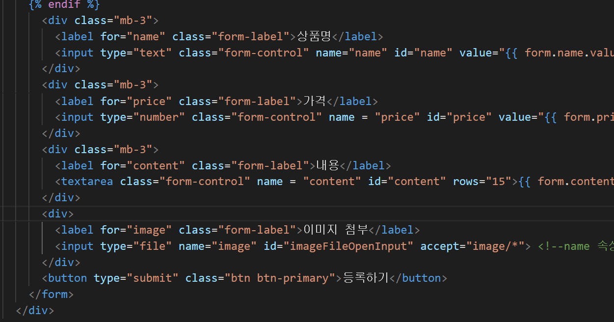
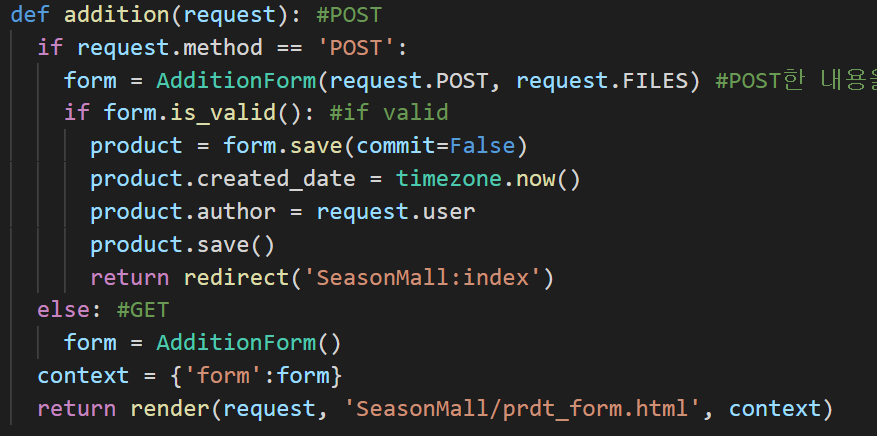
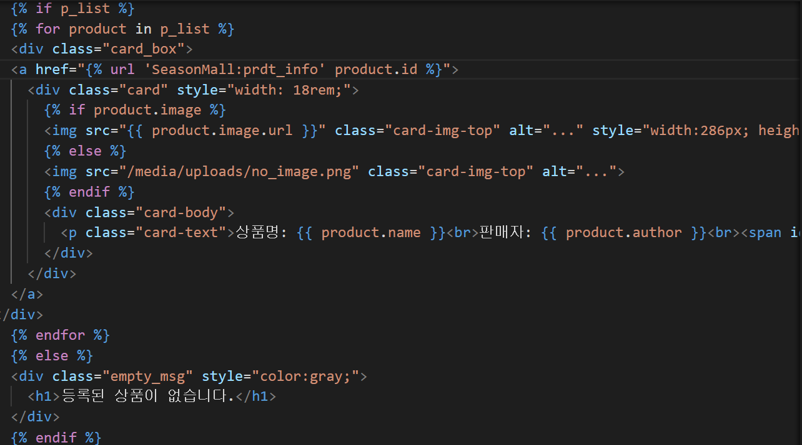
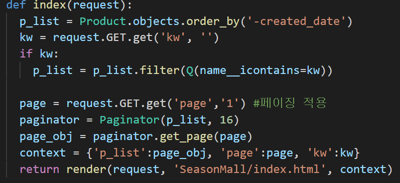
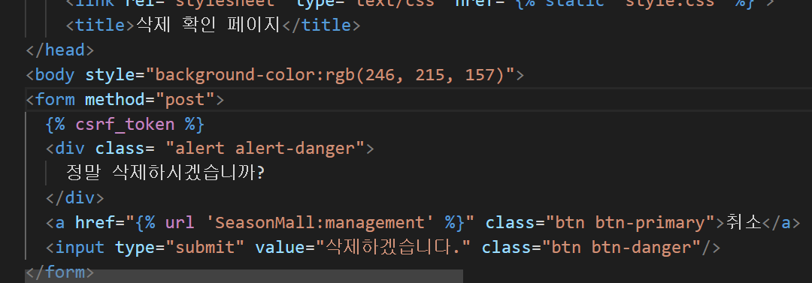
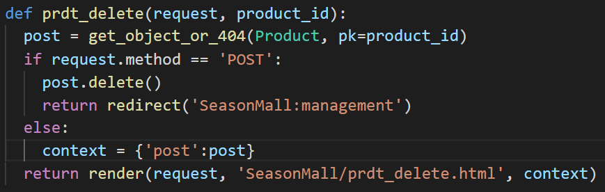
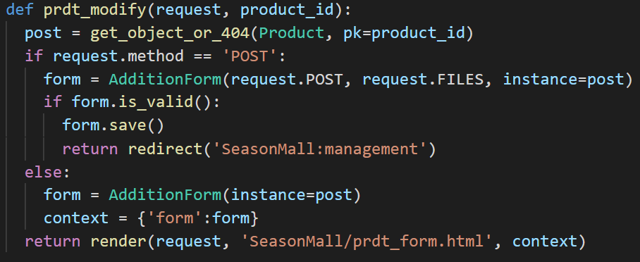

# Season Mall  

중고 쇼핑몰 개인 토이프로젝트  
링크: [Season Mall](http://wyndday.pythonanywhere.com/SeasonMall/)

## Description  
+ 개발 환경
  - Language: Python
  - Framework: Django
  - DB: MySQL
  - front-end: HTML, CSS, JavaScript, Bootstrap, Jquery
  - Server: PythonAnywhere
## Views  
+ 홈
  .png)
+ 회원가입
  .png)
+ 로그인
  .png)
+ 내 프로필
  .png)
+ 상품 관리
  .png)
  + 상품 등록
    .png)
  + 상품 수정/삭제
    .png)
    .png)
+ 검색엔진
  .png)
+ 상품 클릭
  .png)
+ 상품 구매
  .png)
+ 상품 결제
  .png)
## CRUD  
+ 상품 등록 (CREATE)
  
  
  - 상품 등록 시 GET 방식을 통해 상품 등록 창을 불러온 뒤, 폼을 항목에 따라 작성하게 하여 POST 방식으로 데이터를 전송해 view에서 해당 데이터를 DB에 저장
+ 상품 진열 (READ)
  
  
  - 존재하는 상품을 하나씩 DB로부터 불러들여 등록날짜순으로 진열하고, 16개의 상품이 한 페이지에 모두 나타날 시 다음 페이지에 등록되도록 pagination을 사용
  - url에 키워드가 추가되어 있지 않다면 모든 데이터를 불러들이고, 추가되어 있으면 이름에 키워드가 포함된 데이터를 불러옴
+ 상품 삭제 (DELETE)
  
  
  - 상품 관리 페이지로 입장할 시 자신이 등록한 상품을 삭제할 수 있고, 유저가 상품을 삭제하기 전에 확인용 페이지를 나타냄
+ 상품 수정 (UPDATE)
  
  - 상품 삭제 페이지와 마찬가지로 상품 관리 페이지로 입장하여 수정이 가능하며, 상품 등록 기능과 같지만 instance를 사용해 수정하려는 항목의 폼을 작성해 DB에 같은 데이터로서 저장